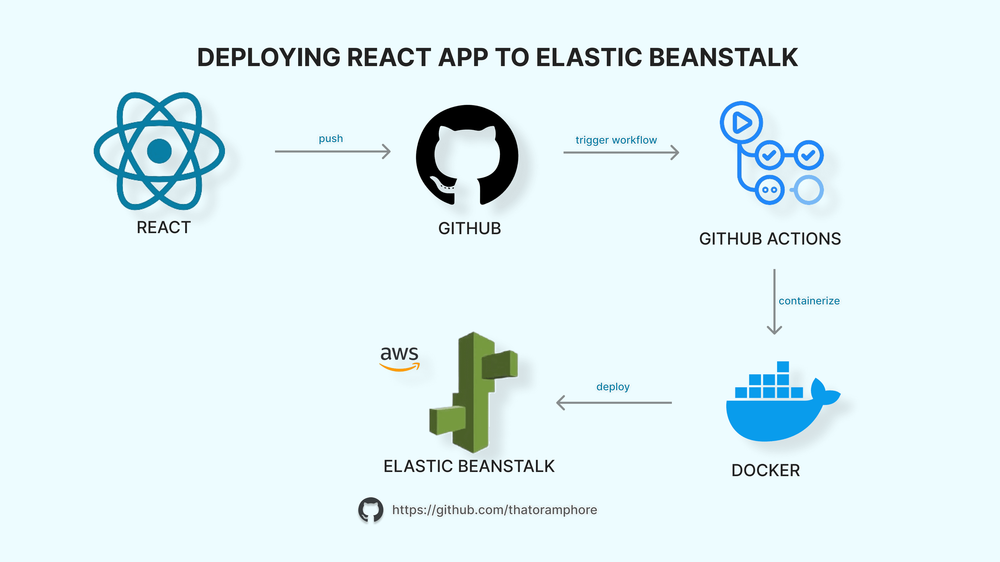

# React App Deployed to AWS Elastic Beanstalk with GitHub Actions

#### This project utilizes CI/CD pipeline (GitHub Actions) to deploy a React app to AWS Elastic Beanstalk. 

☁️**GitHub Actions** is a powerful CI/CD (Continuous Integration and Continuous Deployment) tool hat lets you automate your software development workflows directly within your GitHub repository.

## Prerequisites

 * Active [AWS Account](https://aws.amazon.com/)
 * [AWS CLI](https://docs.aws.amazon.com/cli/latest/userguide/getting-started-install.html) setup

## What could be improved / what's to be implemented continuously 

 * TESTING & VALIDATION
    - Adding stages for linting, testing, and security checks before deployment
 * MULTI-BRANCH REPO
    - Using multi-branch repo to keep the 'main' branch as the only source of truth
 * LOGGING & MONITORING
    - Enabling CloudWatch Logs and metrics for better visibility and troubleshooting
* PROVISIONING INFRASTRUCTURE WITH IaC 
    - Using Terraform to provision AWS Elastic Beanstalk

